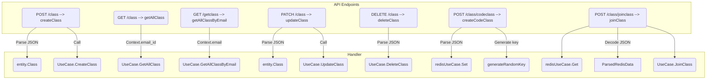

# Class Router Diagram (Mermaid)

```mermaid
graph TD
  subgraph API Endpoints
    createClass(POST /class --> createClass)
    getAllClass(GET /class --> getAllClass)
    getAllClassByEmail(GET /getclass --> getAllClassByEmail)
    updateClass(PATCH /class --> updateClass)
    deleteClass(DELETE /class --> deleteClass)
    createCodeClass(POST /class/codeclass --> createCodeClass)
    joinClass(POST /class/joinclass --> joinClass)
  end
  subgraph Handler
    createClass -->|Parse JSON| ClassEntity1(entity.Class)
    createClass -->|Call| classUseCaseCreate(UseCase.CreateClass)

    getAllClass -->|Context.email_id| classUseCaseAll(UseCase.GetAllClass)
    getAllClassByEmail -->|Context.email| classUseCaseAllEmail(UseCase.GetAllClassByEmail)

    updateClass -->|Parse JSON| ClassEntity2(entity.Class)
    updateClass -->|Call| classUseCaseUpdate(UseCase.UpdateClass)

    deleteClass -->|Parse JSON| classUseCaseDelete(UseCase.DeleteClass)

    createCodeClass -->|Parse JSON| RedisSet(redisUseCase.Set)
    createCodeClass -->|Generate key| RandomKey(generateRandomKey)

    joinClass --> RedisGet(redisUseCase.Get)
    joinClass -->|Decode JSON| ParsedRedisData
    joinClass --> classUseCaseJoin(UseCase.JoinClass)
  end
```
